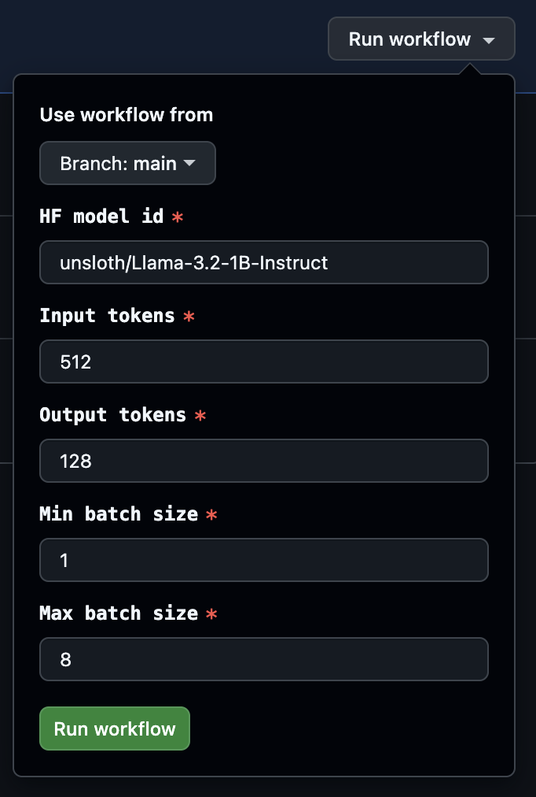
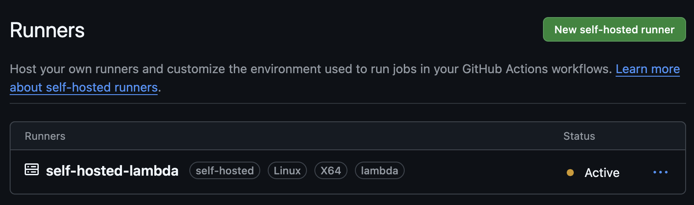
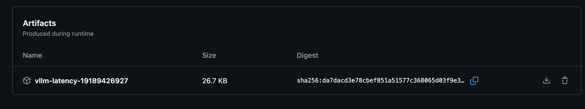
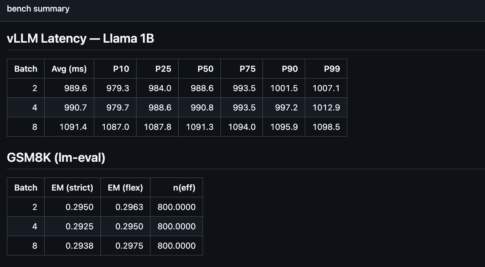
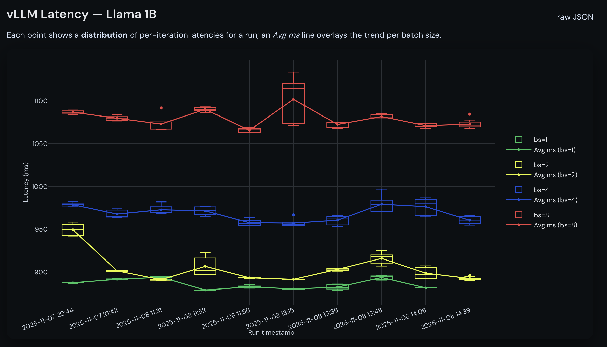
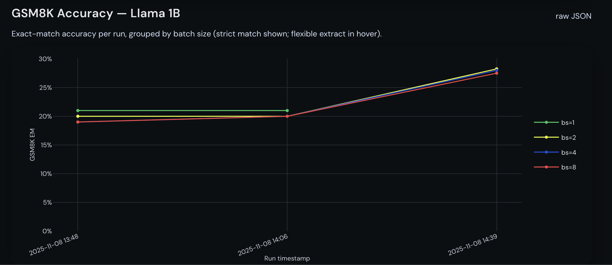
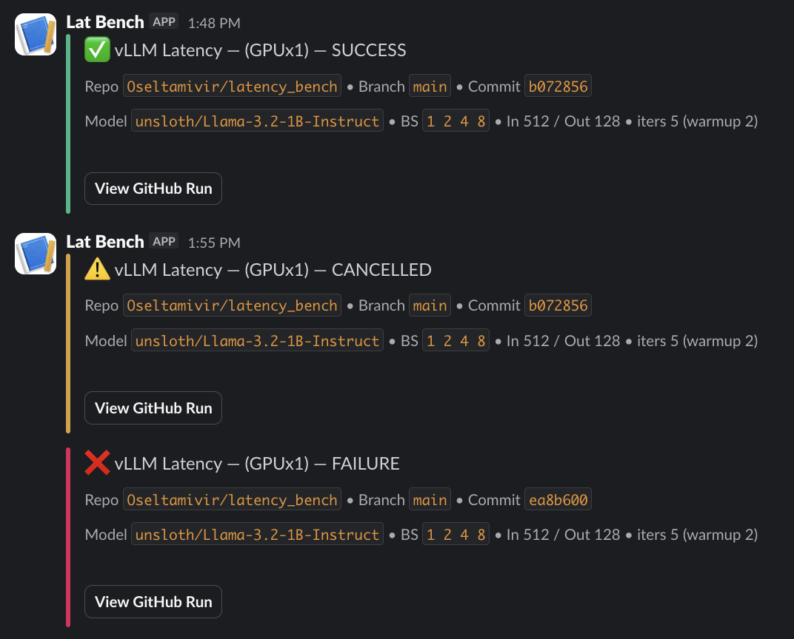

This repo consists of autoamted benchmarks with GPU access through lambda labs.
### **Goal 1**: Github Action that runs every hour and benchmark latency on vllm Llama 8B
- ✅ Due to limited instances, I have used Llama3.2-1B instead. To save time, I've removed the BS=1 run.
- 3 Different workflows
    - ### [vLLM Latency](.github/workflows/vllm-latency.yml)
        - This is the economical workflow that spins up a new instance every run. 
            - Takes ~5mins to boot (Not billed)
        - Launches instance with Lambda API, SSHes in, creates a venv, installs deps, and runs vllm bench latency for batch sizes 1, 2, 4, 8 with the provided input/output lengths and iters, saving latency_bs*.json + logs.
    - ### [vLLM Manual Bench (Dispatcher)](.github/workflows/run-latency-manual.yml)
        - Allows quick modification of workflow parameters, calls vLLM Latency bench using these inputted parameters.
        
        

    - ### [Self-hosted vLLM Latency](.github/workflows/empheral-runner.yml)
        - Uses an already running instance as a github self hosted runner. [This script](startup.sh) needs to be run to set up the instance as a self hosted runner.

        
    - All workflows follow up the benchmark with:
        1. Publishing: Uploads artifacts, prints a Markdown table to the job summary, and appends structured entries to docs/data/latency_history.json 
        2. Pushes updated `json` to gh-pages branch 
        3. Automatic workflow rebuilds github pages @ https://oseltamivir.github.io/latency_bench/
    
### **Goal 2**: Upload benchmark results as GitHub Artifacts in the run
- ✅ Consists of stdout logs, json results, and env info.

### **Goal 3**: Process all results in the run, create a table and add to GitHub summary
- ✅ Retrieve and display on Github Actions summary markdown with python.

---
#### Stretch goal 1: create a chart and plot of the results for each test that updates over time 
- ✅ Displayed with github pages, automatically updated when any benchmark workflow ends
- I tried to emulate SA's styling: Font, colours, BG.
- Values on the plots below varied as I was changing warmup and iters between runs.

#### Stretch goal 2: create alerting in case the pipeline fails to run. Deliver alerts to shared slack 

- ✅ Via Slack webhook, require admin's approval to enable. Extends to email via slack channel notifications, easier to add people or mute notifications.

#### Stretch goal 3: Manual workflow dispatch 
- ✅ Done with vLLM Manual Bench Dispatcher

#### Stretch goal 4: gsm8K via lm-eval
- ✅ Done, summary + plots are show above.