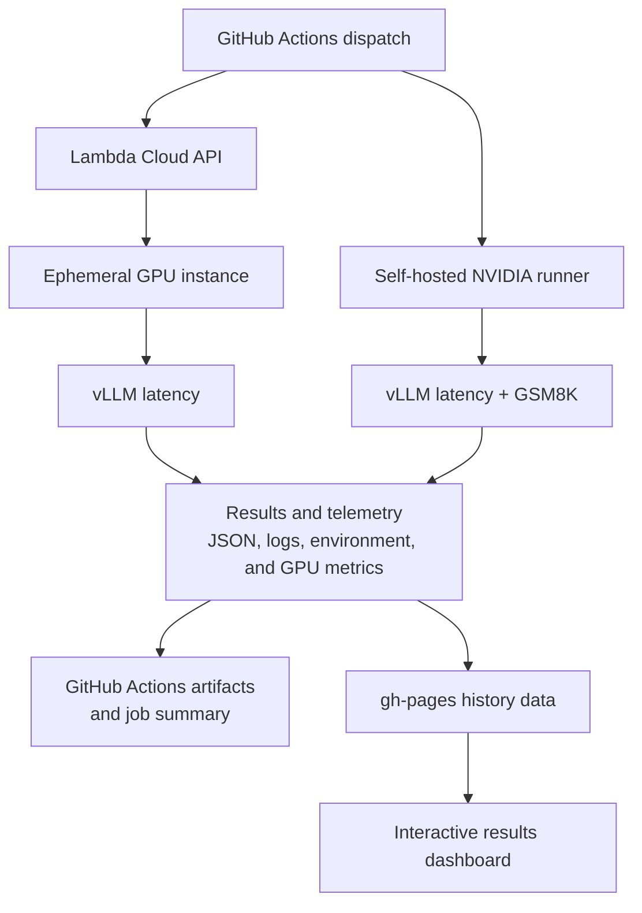

# vLLM Latency Bench

[](https://github.com/Oseltamivir/latency_bench/actions/workflows/vllm-latency.yml)
[](https://oseltamivir.github.io/latency_bench/)


Automated GPU benchmarking for measuring vLLM latency and GSM8K accuracy. The
pipeline can provision an ephemeral Lambda Cloud instance or use a self-hosted
NVIDIA runner, capture reproducibility metadata and GPU telemetry, publish
GitHub Actions artifacts, and append results to a GitHub Pages dashboard.

## Highlights

- Runs `vllm bench latency` across a configurable batch-size sweep.
- Supports ephemeral Lambda Cloud GPUs and persistent self-hosted GPU runners.
- Evaluates GSM8K through `lm-eval` on the self-hosted workflow.
- Records latency distributions, environment versions, GPU details, and
  time-series utilization metrics.
- Publishes downloadable artifacts and Markdown summaries for every run.
- Stores historical results on the `gh-pages` branch for interactive plotting.
- Sends optional Slack notifications for successful, failed, or cancelled runs.
- Terminates provisioned Lambda Cloud instances even when a workflow fails.

## Pipeline



## Workflows

| Workflow | Execution environment | Purpose |
| --- | --- | --- |
| [`vllm-latency.yml`](.github/workflows/vllm-latency.yml) | Ephemeral Lambda Cloud GPU | Provisions an instance, installs vLLM, runs a latency sweep, downloads results, terminates the instance, and publishes latency history. |
| [`run-latency-manual.yml`](.github/workflows/run-latency-manual.yml) | GitHub-hosted dispatcher | Provides a simpler manual form for selecting the model, sequence lengths, and batch-size range used by the Lambda Cloud workflow. |
| [`empheral-runner.yml`](.github/workflows/empheral-runner.yml) | Self-hosted NVIDIA GPU | Runs latency and GSM8K benchmarks, captures detailed host and GPU telemetry, and publishes both result histories. |

The workflows on `main` currently run through manual dispatch or reusable
workflow calls. Scheduled execution is not enabled.

## Current Defaults

| Setting | Lambda Cloud | Self-hosted |
| --- | ---: | ---: |
| Model | `unsloth/Llama-3.2-1B-Instruct` | `unsloth/Llama-3.2-1B-Instruct` |
| Input length | 512 tokens | 512 tokens |
| Output length | 128 tokens | 128 tokens |
| Batch sizes | 1, 2, 4, 8 | 2, 4, 8 |
| Measured iterations | 5 | 40 |
| Warm-up iterations | 2 | 10 |
| GSM8K | Not run | 8-shot, 800-sample limit |

Dispatch inputs can override the model, input length, output length, and batch
sizes for the Lambda Cloud workflow.

## Results

Each benchmark run can produce:

- `latency_bs*.json`: average and percentile latency for each batch size.
- `latency_bs*.log`: complete `vllm bench latency` output.
- `gsm8k_bs*/**/results_*.json`: GSM8K metrics from `lm-eval`.
- `gsm8k_bs*.log`: evaluation logs.
- `env.json`: Python, PyTorch, vLLM, Transformers, CUDA, driver, OS, and memory
  metadata.
- `gpu.json` and `gpu.txt`: structured and human-readable GPU information.
- `cpu.json`: CPU topology and model information.
- `metrics/gpu_timeseries.csv`: utilization, memory, clock, temperature, and
  power samples.

[`scripts/collect_results.py`](scripts/collect_results.py) converts these files
into GitHub job-summary tables and appends normalized records to:

- `docs/data/latency_history.json`
- `docs/data/gsm8k_history.json`
- `docs/data/gpu_metrics/<timestamp>.csv`

The history is available through the
[interactive dashboard](https://oseltamivir.github.io/latency_bench/).

<details>
<summary>Additional screenshots</summary>

### GSM8K History


### GitHub Actions Summary


### Run Artifacts


### Slack Notification


</details>

## Running on Lambda Cloud

### Repository variables

Configure these under **Settings > Secrets and variables > Actions > Variables**:

| Variable | Description |
| --- | --- |
| `LL_REGION` | Lambda Cloud region name. |
| `LL_INSTANCE_TYPE` | GPU instance type requested from Lambda Cloud. |
| `LL_SSH_KEY_NAME` | Name of the SSH public key registered with Lambda Cloud. |

### Repository secrets

| Secret | Required | Description |
| --- | --- | --- |
| `LAMBDA_API_KEY` | Yes | API credential used to launch, inspect, and terminate instances. |
| `LL_SSH_PRIVATE_KEY` | Yes | Private key matching `LL_SSH_KEY_NAME`. |
| `HF_TOKEN` | For gated models | Hugging Face token passed to the benchmark host. |
| `SLACK_WEBHOOK_URL` | No | Incoming webhook used for run notifications. |

After configuration:

1. Open the repository's **Actions** tab.
2. Select **vLLM Manual Bench (Dispatcher)**.
3. Choose the model, sequence lengths, and minimum and maximum batch sizes.
4. Run the workflow and monitor the job summary.

The workflow creates a fresh Python environment on the remote instance, installs
`vllm[bench]`, runs the requested sweep, copies the results back with `scp`, and
then terminates the instance in an `always()` cleanup step.

## Running on a Self-hosted GPU

The self-hosted workflow expects:

- An Ubuntu runner registered with this repository.
- An NVIDIA GPU with a working driver and `nvidia-smi`.
- `sudo` access for installing `jq`, `python3-venv`, and `sysstat`.
- Enough disk space for the selected model and generated artifacts.
- `HF_TOKEN` when the selected model requires authentication.

[`startup.sh`](startup.sh) contains the repository-specific runner registration
settings used for the original environment. Generate a fresh registration token
from GitHub before adapting it for another host.

Once the runner is online, select **Self-hosted vLLM Latency** in the Actions tab
and dispatch the workflow.

## Local Result Processing

Existing result files can be summarized without rerunning a GPU benchmark:

```bash
python3 scripts/collect_results.py summary \
  --results-dir results
```

To append latency and GSM8K records to local history files:

```bash
python3 scripts/collect_results.py append-history \
  --results-dir results \
  --hist-path docs/data/latency_history.json \
  --gsm-path docs/data/gsm8k_history.json
```

## Repository Layout

```text
.
|-- .github/workflows/
|   |-- vllm-latency.yml
|   |-- run-latency-manual.yml
|   `-- empheral-runner.yml
|-- pics/
|-- scripts/
|   |-- collect_results.py
|   `-- record_metrics.py
|-- requirements.bench.txt
|-- startup.sh
`-- README.md
```

## Benchmark Interpretation

Latency results are only directly comparable when the model, hardware, vLLM
version, CUDA stack, input and output lengths, batch size, tensor parallelism,
and iteration counts are equivalent. Environment metadata is retained with each
run so changes in the software or hardware stack can be identified when
reviewing historical results.

Secrets are supplied through GitHub Actions and are not stored in the repository.
Use scoped credentials, rotate exposed credentials immediately, and review
workflow logs before sharing artifacts publicly.
